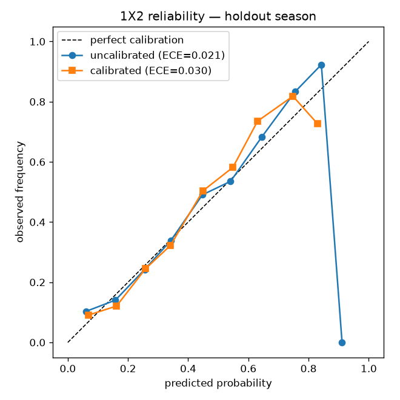

# Backtest report — Dixon-Coles vs the market

*Generated by `scripts/run_backtest.py`. Walk-forward, refit every gameweek,
leakage-safe (each fit sees only results strictly before the round's kickoff).*

## Setup
- **Predictions:** 1827 matches, out-of-sample, across seasons
  `2021`–`2526` (the first season is warmup —
  used only to train, never predicted).
- **Time decay:** xi = 0.0040, chosen walk-forward on the full history.
- **Calibration:** temperature scaling, T = 1.139, fit on the
  pre-holdout seasons and applied to the held-out season `2526`.
- **Market blend:** log opinion pool of the calibrated model and the de-vigged
  *opening* consensus, market weight w = 1.00 chosen walk-forward on
  the pre-holdout seasons (rolling windows, mean out-of-sample log-likelihood).
- **Skipped:** 9 fixtures with an unseen team (no prior
  top-flight history at the cutoff), 0 for missing odds.
- **Baseline:** de-vigged market average (`Avg*`) closing odds — the strong
  baseline. Matching it is good; beating it is hard.

## Overall (all predicted seasons)
| forecast | n | RPS | log-loss | Brier | ECE |
|---|--:|--:|--:|--:|--:|
| model (uncalibrated) | 1827 | 0.2046 | 1.0019 | 0.5980 | 0.0127 |
| model (calibrated) | 1827 | 0.2045 | 1.0010 | 0.5978 | 0.0105 |
| blend (model x open) | 1827 | 0.1976 | 0.9775 | 0.5808 | 0.0119 |
| market (open, de-vig) | 1827 | 0.1976 | 0.9775 | 0.5808 | 0.0119 |
| market (close, de-vig) | 1827 | 0.1967 | 0.9744 | 0.5787 | 0.0136 |

## Holdout season `2526` (calibrator never saw it)
| forecast | n | RPS | log-loss | Brier | ECE |
|---|--:|--:|--:|--:|--:|
| model (uncalibrated) | 305 | 0.1983 | 0.9827 | 0.5812 | 0.0206 |
| model (calibrated) | 305 | 0.1996 | 0.9848 | 0.5838 | 0.0296 |
| blend (model x open) | 305 | 0.1907 | 0.9517 | 0.5618 | 0.0366 |
| market (open, de-vig) | 305 | 0.1907 | 0.9517 | 0.5618 | 0.0366 |
| market (close, de-vig) | 305 | 0.1902 | 0.9495 | 0.5608 | 0.0354 |

Reliability before/after calibration: 

## Value betting + CLV
- **Bets placed:** 1024 (1-unit flat stake, edge > 0.05 vs de-vigged opening consensus, bet at Bet365 opening)
- **ROI:** -10.272% (profit -105.19 on 1024 staked) — variance-dominated, not evidence of edge
- **Win rate:** 23.4%
- **Beat the closing line:** 37.0% of bets
- **Mean CLV:** +0.24% (opening vs closing price) — the signal to trust over ROI

## Honest read
On RPS — the metric that matters for ordinal H/D/A — the calibrated model is
**behind the market** (model 0.2045 vs market 0.1967,
gap +0.0078; lower is better). That is the expected result: the closing line
aggregates money and sharper information than a goals-only Dixon-Coles fit, so
landing within a hundredth of an RPS point of it means the core model is sound.

Temperature scaling (T = 1.139) found the model only mildly overconfident, and on this 305-match holdout it nudged ECE the wrong way (0.0206 → 0.0296). On so few matches that's noise, not a regression to fix — the honest read is that the raw probabilities were already near-calibrated and there was little for one parameter to do.

The weight search gave the market **full weight (w = 1.00)**: on the pre-holdout folds, walk-forward log-likelihood rises monotonically all the way to the pure de-vigged opening line, so the "blend" row *is* the open (holdout RPS 0.1907 vs model 0.1996). The honest reading: a goals-only Dixon-Coles carries no information the opening odds don't already price in. That is the null result the blend was built to expose — the machinery stays, and the weight is worth re-checking after any base-model improvement (pre-match xG is the obvious candidate); if it moves off 1.0, the model has finally learned something the market hadn't.

The value-bet ROI over ~1000 bets is dominated by variance and should not be read
as edge. **CLV** is the more trustworthy signal of skill, and the number above is
what to believe over ROI. What would actually move the *base model* further:
pre-match xG team strength instead of goals and lineup-aware data — enrichment on
this calibrated core, not changes to it.
